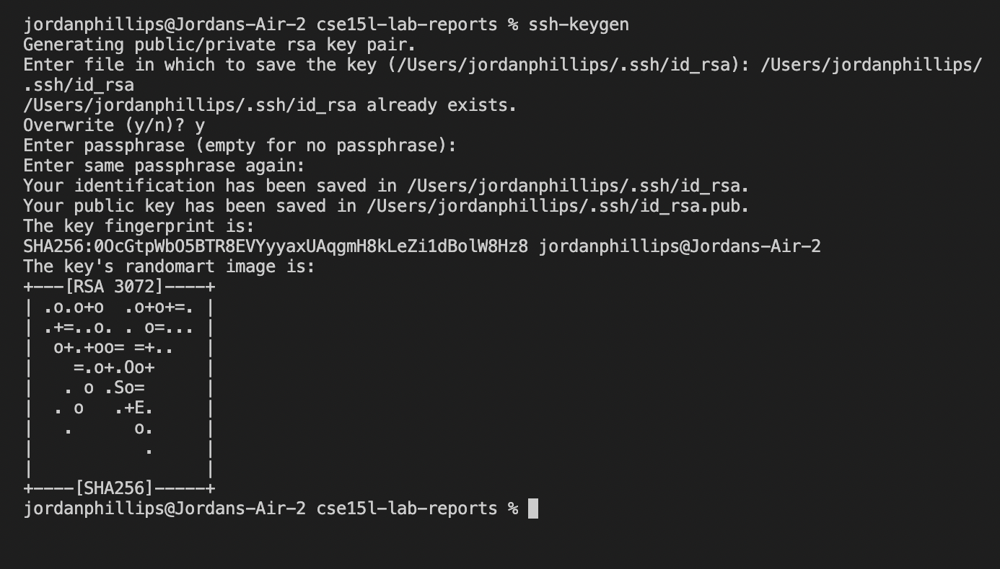

# Lab Report 2: Logging into ieng6 for Offline Access
## Step 1: Installing VSCode
To download Visual Studio Code, got to their website [here](https://code.visualstudio.com/) and follow their instructions on how to download VSCODE to your device. 
When this is complete you should be able to see this screen: 

## Step 2: Remotely Connecting
To connect offline, you first need to know your course-specific account for this class which you can find [here](https://sdacs.ucsd.edu/~icc/index.php)
Next, open a terminal in VSCode and type the command below with your username

If you get a screen asking you if you want to continue connecting, enter **yes** to the terminal. Then, type your password and hit enter. 

## Step 3: Trying Some Commands
Now that you're logged in to you account, try running some commands. Some commands you can try are cd, ls, mkdir, pwd, and cp. Here is an example of what should happen when you run ls on the remote computer: 

## Step 4: Moving Files with scp
To practice moving files, we created a file on our computer called WhereAmI.java and then had to use the **scp** command to copy it to the ieng6 directory

You will have to enter your password again to do this. Then when you log back in to your ieng6 account and enter **ls** command and see it on the directory there. 

## Step 5: Setting an SSH Key
Entering this long password over and over is a pain in the butt, but there is a shortcut for this. You can set a blank ssh key so that whenever it asks you for your password you can just hit enter. Execute the following:

Then log in to your ieng6 account again and run **mkdir .ssh** and then logout
Finally, on your client computer run 

## Step 6: Optimizing Remote Running
A few shortcuts: 
- After an ssh command you can use quotes around a command you want to execute on that server and then logout immediately

- To execute multiple commands on the same line, separate each command with semicolons
- To recall the last command that was run, use the up-arrow on the keyboard 