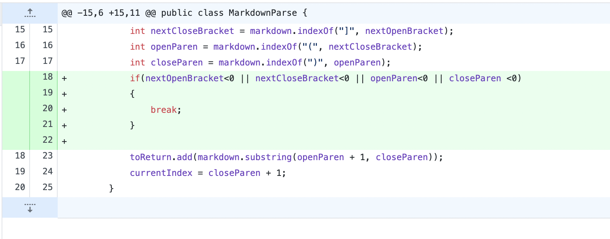
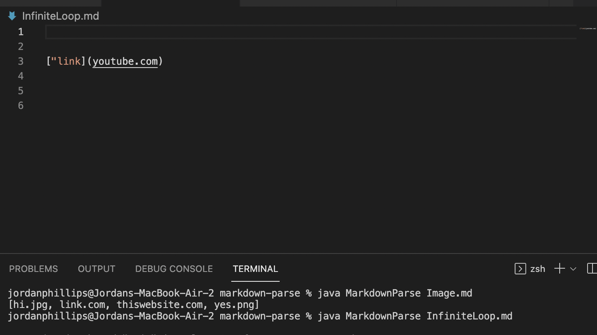
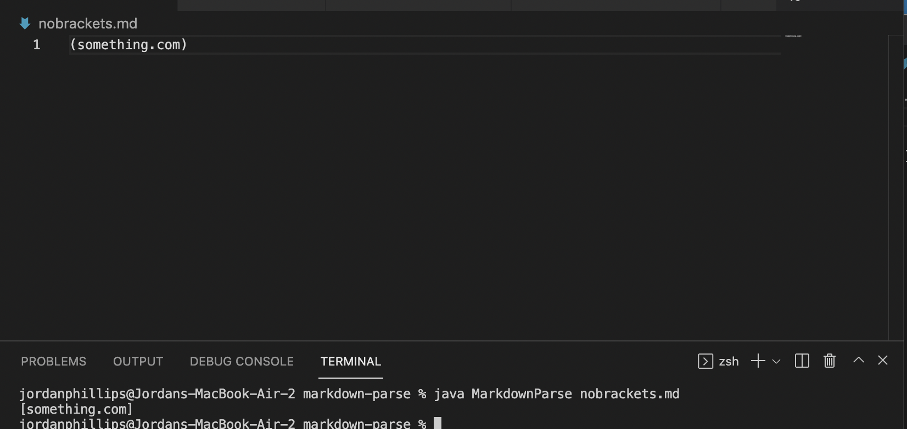
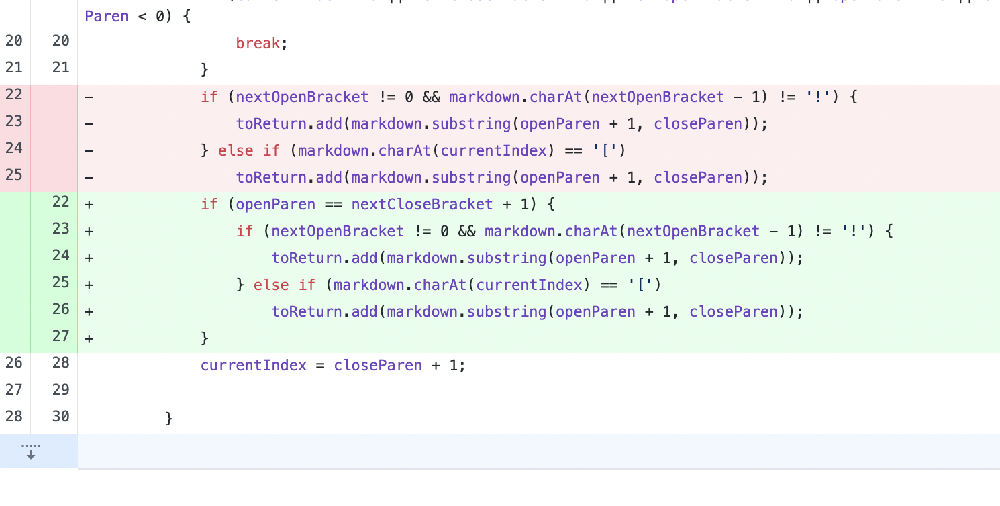
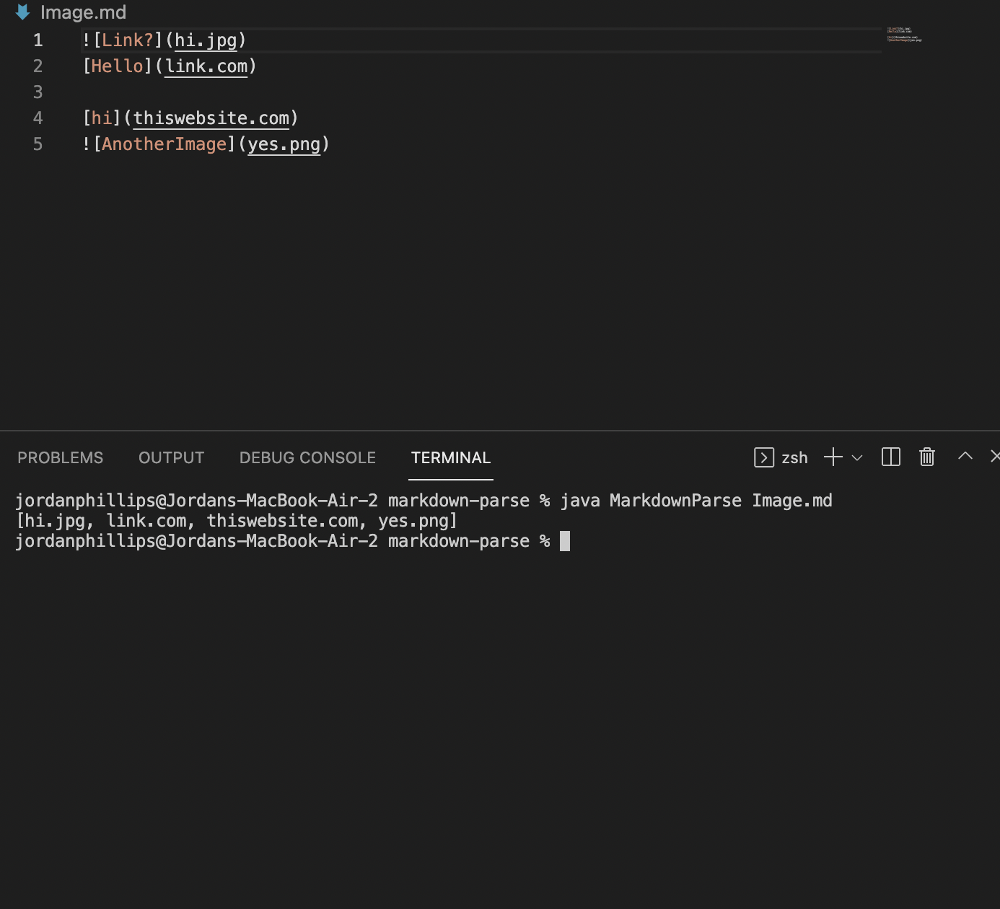

# Lab Report Week 4: 

## Error 1: Infinite Loop

Link to test file: [infinite loop](InfiniteLoop.md)

The infinite loop was caused by the code searching for something that does not exist since there is no index of it. To solve this, we added if statements to account for instances where the index of a parntheses or bracket outputted to -1 because it was not there. 
## Error 2: No Brackets

Link to test file: [no brackets](nobrackets.md)

This example provided an input with no brackets, but the output still listed it as a link. This error was solved using the same code that solved the infinite loop. By breaking when there are no brackets present, this error is avoided. 
## Error 3: Image

Link to test file: [image](Image.md)

This example provided an input with an image and the terminal output listed the image as a link. To fix this error, we had to account for the "!" symbol that determined whether or not the phrase insed the parentheses was a link or an image. 
