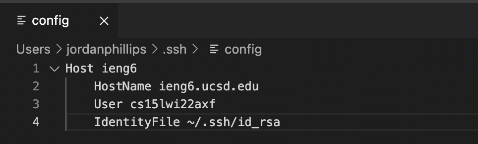
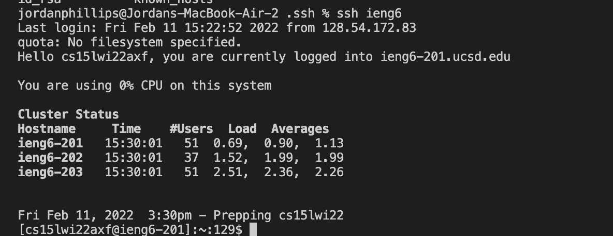

# Lab Report Week 4: 
Group choice 1: Streamlining ssh configuration
## Config File

Creating this file in .ssh allows for logging in to my ieng6 account by just typing "ieng6" rather than my whole username. At first, I did not include the line referencing my id_rsa file which meant I would have to type my whole password in for the account. Now I just type in "ieng6" and press enter. 
## SSH Command

I then practiced using ssh to log into my account which was as simple as typing in my alias and pressing enter. 
## SCP Command

I then used scp to copy a test file to my ieng6 account using the alias. This worked impeccably. 