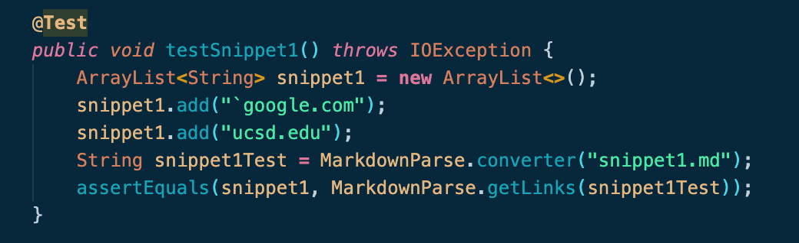
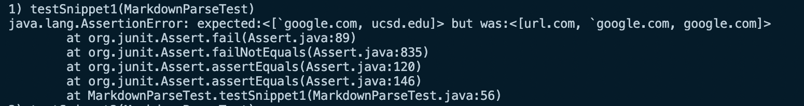
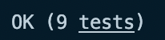
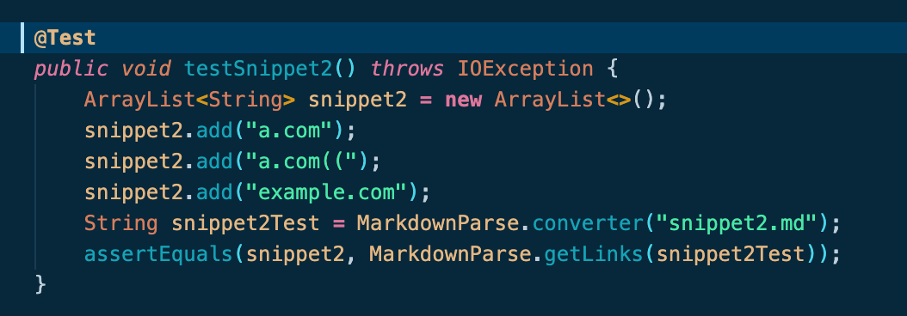
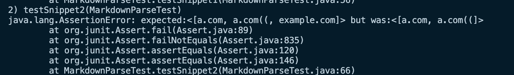
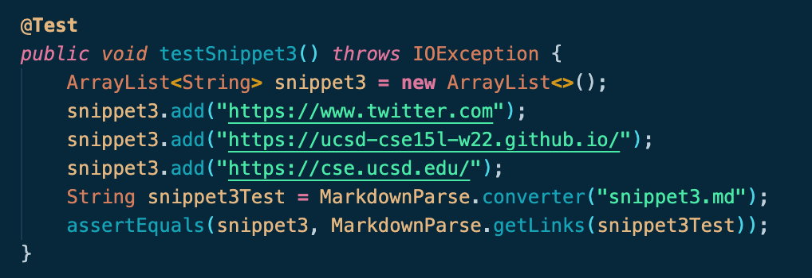
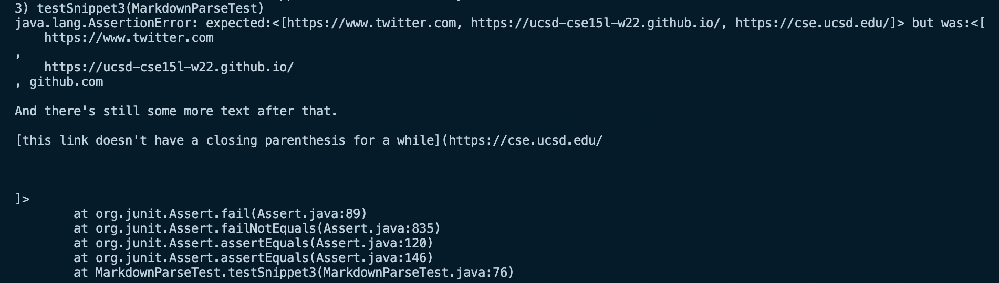

# Lab Report Week 8
[My Repository](https://github.com/jordphilli/markdown-parse)

[Reviewed Repository](https://github.com/austin-li/CSE15L-TheLunaMoths)

## Snippet 1

My implementation output: 

Reviewed implementation output:

Theirs passed. 

To fix our code, I would delete some lines because comparing our code to the code we reviewed our code looks a little repetetive and not as concise. We would also have to include a line checking for the presence of " or ' and the contents between them since this would essentially be commented out. 

## Snippet 2

My implementation output: 

Reviewed implementation output:

Theirs passed. 

Similar to before, I would make our code more concise. Additionally, we would have to check for escaped characters by searching for / characters and their contents. 
## Snippet 3

My implementation output: 

Reviewed implementation output:

Theirs passed. 

To fix our code, I noticed that the group we reviewed checked for " ", or spaces, in the name of the link. I think if we applied this to our code we would achieve the desired output to snippet3. 
