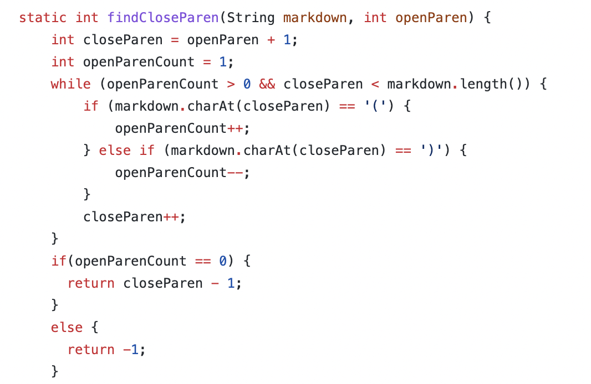

# Lab Report Week 10
## How I found different results: 

I used the diff command on the results of running a bash loop. 
## Bug 1:
Line 212 of the files is different, which refers to test 194: 

The expected output should be [url], but my version of Markdownparse did not count this as a valid link. This is because my code does not account for the "\" character which makes the next character a part of the string in the name of the link. 
Code to be edited: 

## Bug 2: 
Bug 2 is at line 230 which refers to test . 

My code says there is no link and the other version says that there is [baz]. The expected output is that there is no link. Thus, the other code needs to be changed to account for the : and the <>.
Code to be edited:
 